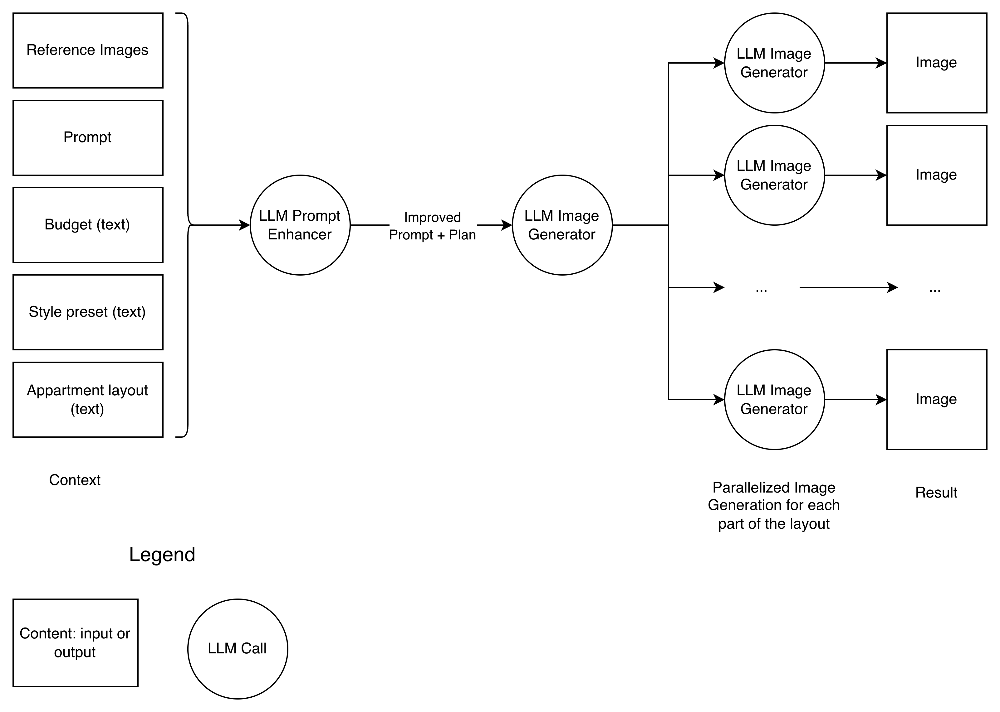
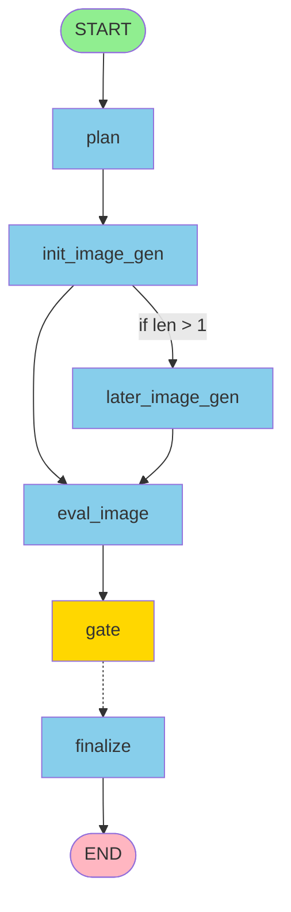

# Interier AI Design Generation
The solution is tasked to generate interier design based on user's textual preferences and source image. As input the program takes text + image and outputs multiple images representing different parts of user's appartments + **JSON** report file with details. The details include token usages, costs, recorded automated metrics, and durations of each operation. 

This `README.md` has the following sections:
* **solution-outline** - the explaination what was built and how;
* **how-to-run** - the commands to run the solution;
* **implementation** - the details of development;
* **future-work** - here I reflect on what can improved in the future;
* **testing** - tests details.

## Solution outline


### Input data
The flow starts by gathering inputs. API takes an image from user (potentially multiple images in the future see **Future Work** section). Additionally, budget information, style preset, appartment information extracted from the textual prompt (see **Future Work** section for more details). 

### LLM Planner
All aggregated information is passed to the AI workflow implemented using **LangGraph**. The entrance node is **LLM Planner** that augments prompt making it more appropriate for the system and determines how many images it needs to generate. Current solution is able to generate multiple images of the appartments from different rooms, such that **LLM Planner** determines its number and writes the detailed explanation for each of them.

### Reference image generation
It's important ensure that the pictures follow the same style of appartments giving the consistent final result. However, it's worth to mention that the image, given by user, might not be that reference appartment picture, because it can be whatever the user wants to put in context: drawings, plans, screenshots, and ideas.

That's why generation of the first canonical reference appartment image is essential.

### Parallel image generation
After the reference is prepared, the workflow concurrently generates the rest of images for other parts of the plan.

### Evaluation
The system calculcates automated metrics **from every single generated image** using LLM-as-a-Judge.

Even though, exploring of eval metrics is an iterative process, I picked initial list based on my intuition:
* **Budget correspondece** - how generated interier is realistic for the budget given by a user;
* **General prompt correspondence** - how much the picture matches the prompt;
* **Realism** - how much it's real to do it;
* **Satisfaction** - how pleasent it is;
* **Usability** - how usable it is for living;

More details are included at **Future Work** section.

### Report 

I store all the generated images with semantically proper names for them as well as the request and the report. The report includes durations in seconds for every LLM generation including planning, image generations, and evaluations, also the plan, and all of the evaluation results. it also contains token usage information for each independent AI model with transformed from it costs using **LiteLLM**.

### Complexity

Because of the solution's workflow required complexity, the **Graph architecture** is the best option. I built it using **LangGraph**. However, I came to this decision iteratively after hours of planning and development. Modules such as LLM planner and LLM evaluator didn't come at the first day. Remembering the first version, the solution was built in a single service and was much more simple.



The **graph architecture** has several components that were not described at the **solution outline**:
* `finalize` node stores job's aggregated results in the File System;
* `gate` node is a destination for all the `eval_image`s. There the system determines where it's time to `finalize` or exit the branch using condition: **number of planned to generate images == number of evaluation**, because every simple generated image needs to be evaluated.


### RAG & Storage
I did not implement **RAG (Retrieval-augmented-generation)**, nor use **vector databases** because they're architecturally redundant points to provide high-quality interier design images. The images and results are stored locally in the file system as a good starting point.

### Caching

For the reasongs of time, the caching was not imlemented. Though, the concept is simple here: every request is hashing and stored to the cache storage (e.g. **Redis** or **PostgreSQL**) along with the API's response, where the hash is a DB index / key. Once the request with the similar request hash arrives, the system takes the prepared response and responds it saving costs on AI generation. 

The separation of **AI-native** logic to the separate **Python** microservice is always a good approach. Considering that the implemented API is suggested to being run as by **BFF (backend-for-frontenders)**, as well as by **frontend**, the caching can be also implemented at the side of **BFF** using the same principle.


### Observability

Currently, all application logs with **INFO level** are outputed to **STDOUT**. Additionally, they being stored to `logs` folder to ensure they are always recordered and persisted on the running system. There are also **DEBUG level** logs at the folder. (see **Future work**)

## How to run

1. Clone **Git** repo:
    ```
    git clone git@github.com:montarelab/interier_ai.git
    ```

2. Open the folder:
    ```
    cd interier_ai
    ```

3. Install packages:
    ```
    uv sync
    ```
4. Create `.env` file for environment variables:
    ```
    cp .env.example .env
    ```
5. Fill missing enviroment variables in `.env`.

6. Run **Docker daemon**.

7. Run app using **Docker compose**:
    ```
    docker compose up
    ```

- (Optionally) Run app locally:
    ```
    uv run python -m src.main
    ```

## Implementation

The solution is containerized using **Docker** to support running in different environments and scalability. It's imporatant to state API's host and port inside environment variables. Additionally, you can update models used for evluation, planning, image generation, and add LLM API keys. The app is easy to scale by creating new containers of its image. (see **Future work**)


### Libraries used
* `fastapi` - API development;
* `langchain`, `langgraph`, and `jinja2` - workflow graph construction, template rendering;
* `litellm` - LLM automatic costs calculation from token usage metadata;
* `openai` and `google-genai` - AI API of **OpenAI** and **Google**, because **LangChain**/**LiteLLM**/**others** are either poor, or not-asynchronous, or not working for image generation as good as they are for trivial chat and text API;
* `aiofiles` and `pydantic` - productivity: async file operations and validated models development;
* `pytest` and `pytest-asyncio` - testing.


### API Design
* `/generate` - POST endpoint that generates interier images and report based on image and textual prompt as input, and responds with path for the results once the design is generated;
* `/evaluate` - POST endpoint that evaluates the system based on the given evaluation data: AI models to use, tasks, versions of tasks, and responds with the path for the results. Such that, the main point is to understand how the system excels in the given subset of the dataset, The endpoint does not wait for the completion, all the evaluation will be done in the parallel background tasks for each **options product** (model, task, prompt version) item. It just returns that the evaluation was started succesfully. It makes the difference with `/generate`, because there we wait for the completion to respond. It was done, because evaluation process assumes much longer process than 2min, such that another API design is better here (see **Future work**).


### Dataset and tasks
* Dataset is used for evaluation. There are 5 **tasks** inside the dataset and each one corresponds to the unique interier style. 
* There are 6 files inside each **task-folder**: source reference image and 5 versionized prompts. 
* Each task input simulates user's prompt. Even though the prompts are written with **Markdown**, they are structured and contain all the details exlicitly.
* The prompt version determines how specific the user's request is: 1 - specific, 5 - vague.

### Project structure
* `src` - all the **Python** modules necessary for API.
    * `main.py` - main executive point with **FastAPI** app;
    * `graph.py` - main app's AI workflow built with **LangGraph**;
    * `models.py` - **Pydantic** models used for development;
    * `log.py` - logging module;
    * `settings.py` - structured, validatable environment variables accessor;
    * `utils.py` - extra functions including token usages compouning, data type converters, and prompt render functionality;
* `dataset` - includes 5 **tasks** for the system for each unique style. (see **Dataset and tasks**);
* `prompts` - **Jinja2** prompt templates used for AI. They include `plan`, `img_gen`, and `eval` for the corresponding stages of workflow. Additionally, there is `dataset_gen.jinja` that I used to generate the initial dataset of prompts for my own evaluation based on **Pinterest** interier pictures. No parts of the workflow use it, but I used it my own with `gpt-5.2` and added here to keep and version once it will be needed;
* `jobs` - system results. Each folder inside is an exact run of `/generate` or `/evaluate` determined as request's datatime + `UUID`. THere are both request and response stored inside;
* `images` - images used in **README.md**;
* `logs` - logs of the application;
* `tests` - unit and smoke tests for the application.

### LLM models support
Current solution supports only **Google** and **OpenAI** models because there are no unified API for any **any-to-image** AI model provider, while writing my own would be too expensive. I chose these providers as they have flagship models (see **Future work** section).


### Model preferences
* Image generation: `gemini-2.5 (Nano Banana)` - gave me the most pleasent results. It is not that fast, but the quality of details is high. Additionally it gives much more realistic outputs and less halucinations than `gpt-image-1-mini` and `gpt-image-1.5`. Moreover, it's not that long and expensive as `gemini-3-pro-image-preview`.
* Planner LLM and Eval LLM: `gpt-5-mini` + minimal reasoning - ensured the stages are processing fast. For planning and evaluation light and fast models can be used, because the tasks are notheavy on LLM's thinking capabilities.

Overall, the time for the prefered generation (`gemini-2.5` + `gpt-5-mini`) request can take around **2.5 minutes** or **175 seconds**:
* 35s for planning;
* 55 sec for 1st image;
* 55 sec for the rest of images;
* 30 sec for evaluation.

## Future work

* **Input #1:** Application input may take only image or only text. Additionally, it can take multiple images. Such freedom would enhance app's flexibility.
* **Input #2:** It's impossible to trust that a user would provide clear budget, style preset, appartment information. It would be beneficial to upgrade UX by detecting improper for our system text inputs (For example add this detection to the **LLM Planner** that can stop the interier design generation workflow and return to the user with the clarifying questions). As the result, once user provides the clear rewrited textual details, he will be much more satisfied with the results.
* **Evaluation #1:** As the given evaluation metrics were selected based on my intuition and in the scope of the first steps, more metrics will be inevitably discovered. Evaluation metrics exploration is a very iterative process. More tests need to be done and more discoveries.
* **Model support:** Support of multiple model providers including **Alibaba Qwen**. Because of the system's design, writing adapters to the current system is simple.
* **Evaluation #2:** Metrics are important and badly genereated images may reduce customer satisfaction. Implement the **retry-logic** that starts image generation again once evaluation metrics are lower than the **threshold**.
* **API design #1:** As the evaluation process is considered to be long, it's unwise to wait for its full completion during the endpoint call. It'd be beneficial to create a separate endpooint `/check_status/{job_id}` that checks the status of a specific job. At the same time, all the executing jobs are stored in the cache on the DB along with their statuses.
* **API design #2:** The main app's **Docker** container can easily scale to meet demand by creating of new instances of its image. Additional gateway needs to be implemented that will distribute load over them all. Moreover, such approach would support **canary deployment** and **rollout**, where we will be able to release updated replicas slowly and gather real metrics from them.
* **Observaility:** Implement additional logs storing using **Prometheus** to analyze and visualize them at **Grafana**. Additionally, implement LLM calls and **LangGraph** bypasses observability using **LangSmith**.
* **Evaluation report:** Now reports after succesful `/evaluate` are simple: we create a `results.json` file along with the supplementary files in tasks subfolders of the evaluation job. However, in the future, creation of aggregated report file with statistics and plots would improve readability.

## Testing

The application includes unit and smoke tests to ensure core functionality works correctly.

### Setup

Install test dependencies:
```bash
uv pip install -e ".[dev]"
```

### Running

Run all tests. (Use `-v` argument for verbosity):
```bash
uv run pytest tests/
```

Run specific test file:
```bash
uv run pytest {tests/...file.py}
```


### Unit Tests (6 tests)

- Aggregates token usage for a single model
- Aggregates token usage across multiple models
- Handles empty usage list
- Tests **OpenAI** and **Google** usage metadata factory method
- Tests direct **UsageMetadata** initialization

### Smoke Tests (5 tests)

- Verifies **LangGraph** compilation succeeds
- Verifies FastAPI app initialization
- Checks `/generate` and `/evaluate` routes exist
- Validates **CORS** middleware setup
- Basic smoke test for app request handling

## License

This project is licensed under the **MIT License** — see the [LICENSE](./LICENSE) file for details.
